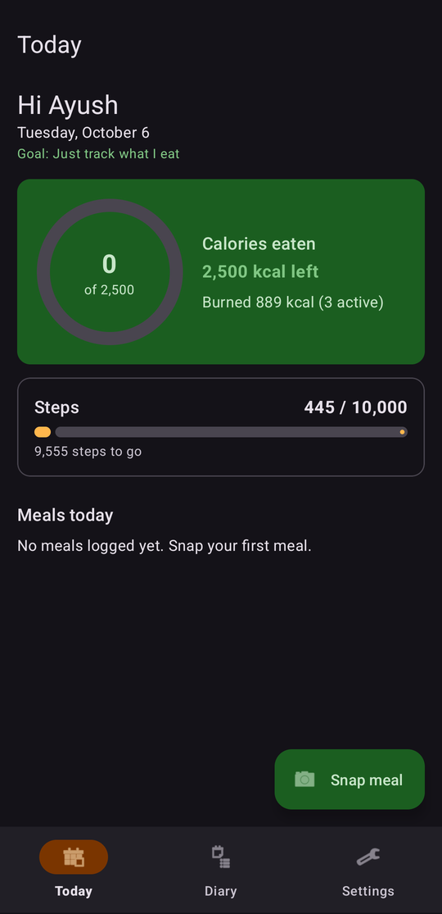
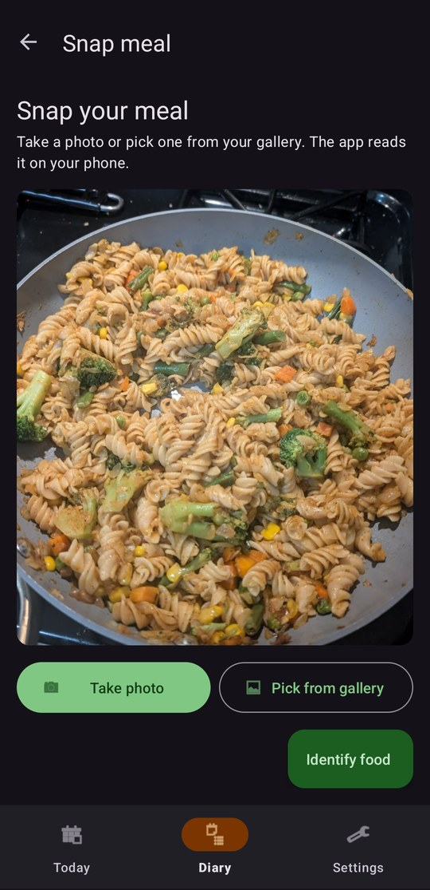
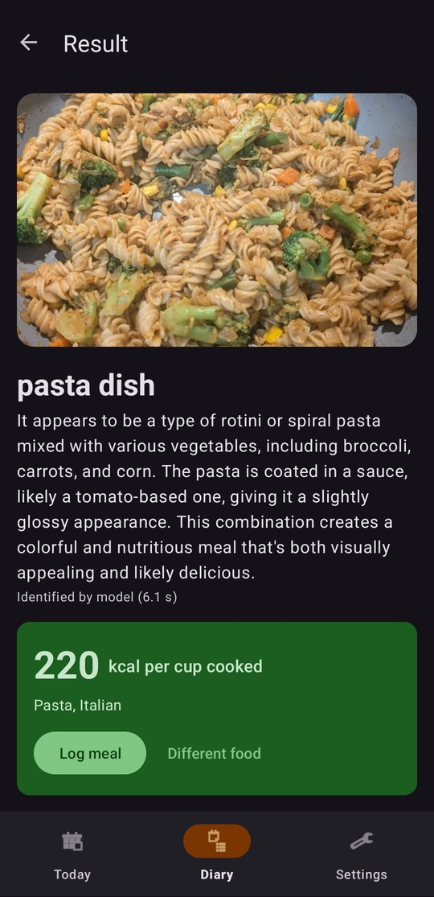
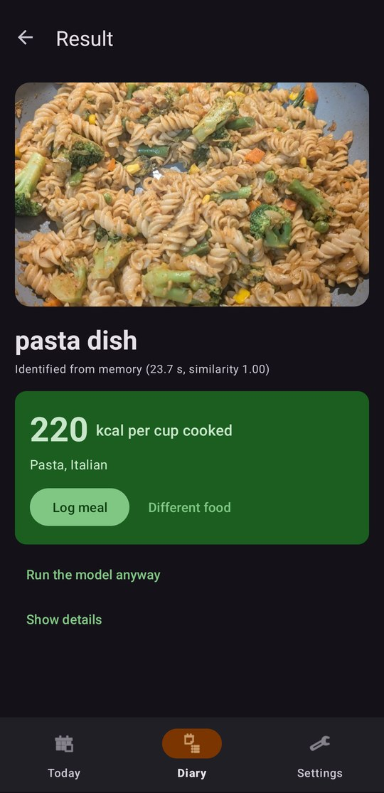

# ThaliWise

Private food recognition and calorie tracking for Android. The AI model operates on the phone.

| Today | Snap a meal | Result from the model | Result from memory |
|---|---|---|---|
|  |  |  |  |

Screenshots: Pixel 8, Android 17, dark theme, 2026-10-06.

## Contents

1. [Overview](#1-overview)
2. [Features](#2-features)
3. [How ThaliWise works](#3-how-thaliwise-works)
4. [Privacy and data](#4-privacy-and-data)
5. [Requirements](#5-requirements)
6. [Installation](#6-installation)
7. [Operation](#7-operation)
8. [Settings](#8-settings)
9. [Performance](#9-performance)
10. [Project structure](#10-project-structure)
11. [Tests and checks](#11-tests-and-checks)
12. [Troubleshooting](#12-troubleshooting)
13. [Limitations](#13-limitations)
14. [Documentation](#14-documentation)
15. [Third-party components](#15-third-party-components)
16. [License](#16-license)

## 1. Overview

ThaliWise identifies the food in a photo. It shows the calories for one serving and records the meal in Health Connect.

The vision language model LFM2.5-VL-1.6B operates on the phone CPU. After the one-time model download, the app operates without a network connection.

The Today screen compares the calories that you ate with a daily budget. It also shows the calories that you burned and your steps.

The name comes from the thali, one plate with many small dishes. ThaliWise knows dishes from many cuisines and helps you balance the day.

## 2. Features

| Feature | Description |
|---|---|
| Food identification | The model gives the dish name, the cuisine, and a short description of the photo. |
| Nutrition table | 320 foods: dishes from 16 cuisines, US fast food, packaged snacks, fruit, and everyday food. The values are for one typical serving. |
| Meal log | You confirm the food, the portion, and the calories. ThaliWise then writes one meal record to Health Connect. |
| Today | A calorie ring, the calories burned, a step bar, and the meals of the day. |
| Diary | The meals of the last 7 days, with a total for each day. |
| Profile | Six short onboarding steps set a daily calorie budget and a step goal. |
| Coach tips | Diet warnings, walk suggestions, and feedback on your food goals. The tips do not stop or delay a meal log. |
| Learning | The app keeps your corrections on the phone and uses them for the next photos. The model itself does not change. |
| Experiment log | Each identification writes time, CPU, memory, and confidence data to a local JSON Lines file. |

## 3. How ThaliWise works

```
photo
  -> copy with a longest side of 512 px (one image tile for the model)
  -> vision encoder, one pass
  -> photo embedding
       -> similar photo in the memory?  yes: label from the memory
                                         no:  prompt with your past corrections
                                              -> LFM2.5-VL answer: label, cuisine, description
  -> match to the nutrition table
  -> you confirm the food, the portion, and the calories
  -> meal record in Health Connect
```

The model names the food. The calories come from the nutrition table, not from the model.

The app learns in two ways. It adds your corrections to the prompt. It also keeps the embedding of each confirmed photo, so a similar photo can get its label from the memory.

For more information, see [docs/MODELS.md](docs/MODELS.md) and [docs/TECHNICAL_REFERENCE.md](docs/TECHNICAL_REFERENCE.md).

## 4. Privacy and data

- ThaliWise does not send photos, meals, profile data, or health data to a server.
- The app uses the network one time only, to download the model files from Hugging Face.
- The photos, the corrections, the profile, and the experiment log stay in the storage of the app on the phone.
- Health Connect access uses 5 permissions. You can remove each permission in Health Connect at any time.

| Permission | Use |
|---|---|
| `READ_STEPS` | Steps on Today and in the coach tips |
| `READ_ACTIVE_CALORIES_BURNED` | Active calories on Today |
| `READ_TOTAL_CALORIES_BURNED` | Calories burned on Today |
| `READ_NUTRITION` | Calories eaten, and the meals of all apps on Today and in the Diary |
| `WRITE_NUTRITION` | The meals that you log, and the deletion of meals that ThaliWise logged |

CAUTION: If you uninstall ThaliWise, Android deletes the model files, the history, and the experiment log. Copy the experiment log to a computer before you uninstall the app.

## 5. Requirements

### 5.1 Phone

| Item | Requirement |
|---|---|
| Android version | Android 14 or newer. Health Connect is a part of Android 14. |
| CPU | arm64 with the dotprod and i8mm instructions. Tested on a Pixel 8. |
| Free storage | 1.5 GB for the model files |
| Memory | Approximately 2.2 GB for the app while the model is loaded |

### 5.2 Build computer

| Item | Version |
|---|---|
| Operating system | macOS (tested on Apple Silicon, macOS 26) |
| Android Studio or Android SDK command-line tools | Current release |
| JDK | 17 or newer (tested with the JetBrains Runtime 21 of Android Studio) |
| Android SDK Platform and Build-Tools | 35 |
| Android NDK | 27.2.12479018 |
| CMake (from the SDK Manager) | 3.22.1 |

## 6. Installation

### 6.1 Build the app

1. Install Android Studio or the Android SDK command-line tools.
2. Install the NDK 27.2.12479018 and CMake 3.22.1 with the SDK Manager.
3. Clone the repository and its llama.cpp submodule:
   ```bash
   git clone --recurse-submodules https://github.com/ayushvarma7/thaliwise.git
   ```
4. Go to the project folder:
   ```bash
   cd thaliwise
   ```
5. Make sure that the file `local.properties` contains `sdk.dir=<path to your Android SDK>`.

   NOTE: Android Studio writes this file when it opens the project.
6. Run the unit tests:
   ```bash
   ./gradlew :core:test
   ```
7. Build the debug APK:
   ```bash
   ./gradlew :app:assembleDebug
   ```

NOTE: The first build compiles llama.cpp for arm64. This takes several minutes. The native code always uses the Release configuration, because a Debug build makes the model much slower.

### 6.2 Install the app on the phone

1. On the phone, set Developer options > USB debugging to on.
2. Connect the phone to the computer with a USB cable.
3. On the phone, tap Allow in the "Allow USB debugging?" dialog.
4. Install the APK:
   ```bash
   adb install -r app/build/outputs/apk/debug/app-debug.apk
   ```

NOTE: The `-r` option replaces an installed copy and keeps its data.

### 6.3 Download the model

1. Open ThaliWise.
2. Do the six onboarding steps. You can skip each question.
3. Tap Settings.
4. Tap Download model.
5. Make sure that Settings shows "Model files are on the device."

NOTE: The download is 1.28 GB. Use a Wi-Fi connection.

| File | Size | Function |
|---|---|---|
| `LFM2.5-VL-1.6B-Q4_0.gguf` | 696 MB | Language model, 4-bit |
| `mmproj-LFM2.5-VL-1.6b-Q8_0.gguf` | 583 MB | Vision encoder and projector, 8-bit |

Source: [LiquidAI/LFM2.5-VL-1.6B-GGUF](https://huggingface.co/LiquidAI/LFM2.5-VL-1.6B-GGUF).

### 6.4 Connect Health Connect

1. Tap Settings.
2. Tap Connect Health Connect.
3. On the Health Connect screen, turn on the 5 permissions.
4. Make sure that Settings shows "Connected."

NOTE: Health Connect receives the steps from other apps, for example Fitbit or Google Fit. Make sure that the Health Connect sync of that app is on.

## 7. Operation

### 7.1 Identify a meal

1. On the Today screen, tap Snap meal.
2. Tap Take photo, or tap Pick from gallery and select a photo.
3. Tap Identify food.
4. Read the dish name, the cuisine, and the calories for one serving.

NOTE: The first identification after an app start loads the model. It takes more time than the next identifications.

NOTE: "Identified from memory" means that the app found a similar photo in its memory. To get a new answer from the model, tap Run the model anyway.

### 7.2 Log a meal

1. On the result screen, tap Log meal.
2. Make sure that the selected food is correct. If it is not correct, type the food name in the search field.
3. Set the portion with the slider (0.5x to 3x).
4. Make sure that the calorie value is correct. If it is not correct, type the correct value.
5. Tap Log.
6. Tap Done to go back to the Today screen.

NOTE: To remove the meal immediately, tap Undo on the result screen.

### 7.3 Delete a meal

1. Tap Diary.
2. Tap the meal.
3. Tap Delete.

NOTE: ThaliWise deletes only the meals that it logged. To delete a meal from another app, use Health Connect.

### 7.4 Change the profile

1. Tap Settings.
2. Tap Edit profile.
3. Change the answers.
4. On step 6, tap Save.

### 7.5 Coach tips

| Location | Tips |
|---|---|
| Result screen, before the log | Up to 3 tips: diet warnings, a walk suggestion, an over-budget note, and feedback on your food goals. Tap Dismiss to hide the tips for that photo. |
| Today screen | One tip for the day. Tap Hide for today to hide it until the next day. |

To stop all tips, set Settings > Coach tips to off.

NOTE: Diet warnings use typical recipes. A dish can be different from the typical recipe.

## 8. Settings

| Setting | Values | Default | Effect |
|---|---|---|---|
| Edit profile | Six onboarding steps | Not applicable | Changes the budget, the step goal, and the coach rules |
| Identification history | List | Not applicable | Shows the identified photos and your corrections |
| Coach tips | On, off | On | Shows or hides all coach tips |
| Download model, Delete model files | Not applicable | Not applicable | Adds or removes the 1.28 GB model files |
| Unload model from memory | Not applicable | Not applicable | Releases approximately 2 GB of app memory |
| Memory shortcut | On, off | On | Lets the app use the label of a similar photo |
| Similarity threshold | 0.80 to 0.99 | 0.92 | A higher value lets the memory match only very similar photos |
| CPU threads | 1 to the number of fast cores (5 on a Pixel 8) | 4 | More fast cores can decrease the time for an answer |
| Vision tokens per image | 64 to 256 | 256 | Fewer tokens decrease the time and show less detail |
| Clear history and memory | Not applicable | Not applicable | Deletes the history, the corrections, the photos, and the experiment log. The model files stay. |
| Connect Health Connect, Refresh, Open Health Connect | Not applicable | Not applicable | Set the Health Connect permissions and read the data again |

## 9. Performance

Values measured on a Pixel 8:

| Measurement | Value |
|---|---|
| First identification after an app start, model load included (4 threads, 2026-10-01) | 11.6 s |
| Identification with the model loaded (2026-10-06, the screenshot above) | 6.1 s |
| Peak app memory with the model loaded | 2.2 GB |
| Model download | 1.28 GB |

The vision encoder uses most of the time. A lower Vision tokens setting decreases the time. For the full measurements, see [docs/TECHNICAL_REFERENCE.md](docs/TECHNICAL_REFERENCE.md), section 3.

## 10. Project structure

```
thaliwise/
  app/                 Android app: UI, Health Connect, Room database, model download
    src/main/cpp/      JNI bridge to llama.cpp (vlm_bridge.cpp)
    src/main/assets/   foods.txt (nutrition table), food_tags.txt (diet tags)
  core/                Pure Java logic with unit tests (no Android imports)
  third_party/
    llama.cpp/         Git submodule, tag b11323
  docs/                Product, model, Health Connect, and technical documents
  tools/refmem/        Tools for a reference photo memory (not part of the app)
```

## 11. Tests and checks

| Command | Result |
|---|---|
| `./gradlew :core:test` | 23 test classes, 116 tests |
| `./gradlew :app:assembleDebug` | Debug APK in `app/build/outputs/apk/debug/` |
| `./gradlew :app:lintDebug` | Lint report in `app/build/reports/` (0 errors) |

The core tests cover the nutrition table, the food matcher, and the answer parser. They also cover the profile math, the walk math, the coach rules, the memory search, and the telemetry statistics.

## 12. Troubleshooting

| Problem | Possible cause | Action |
|---|---|---|
| "Model not downloaded" | The model files are not on the phone. | Tap Settings > Download model. |
| An answer takes a long time | Too many CPU threads, or the first identification after a start. | Set Settings > CPU threads to 4. |
| Today shows no steps | The step app does not write to Health Connect. | Turn on the Health Connect sync in Fitbit or Google Fit. |
| `adb: device unauthorized` | The phone does not trust the computer. | Unlock the phone and tap Allow in the USB debugging dialog. |
| The app stops when the model loads | The CPU does not have the i8mm instructions. | Remove the `GGML_CPU_ARM_ARCH` line from `app/src/main/cpp/CMakeLists.txt` and build again. |
| The dish name is not correct | The model guess is not correct. | Tap Different food and log the correct food. The app keeps the correction. |
| No cuisine label on the result | The model did not give a cuisine line. | No action is necessary. The calorie match still operates. |

## 13. Limitations

- The calories are table values for one typical serving. They are not a measurement of the food on your plate.
- A dish that is not in the table can be logged only with the name of a food that is in the table.
- The model sometimes does not use the requested answer format. The app cleans the answer, but the answer can have no cuisine.
- Diet warnings use typical recipes. Halal checks only pork and alcohol. Kosher checks only pork and shellfish.
- The calorie budget is an estimate from the Mifflin-St Jeor formula. It is not medical advice.
- The model operates on the CPU only.

## 14. Documentation

| Document | Contents |
|---|---|
| [docs/USER_STORIES.md](docs/USER_STORIES.md) | Personas, profile questions, user stories, and the UI storyboard |
| [docs/MODELS.md](docs/MODELS.md) | The on-device model, how ThaliWise uses it, and options for better use |
| [docs/HEALTH_CONNECT.md](docs/HEALTH_CONNECT.md) | The Health Connect data that ThaliWise uses, all 40 record types, and ideas |
| [docs/TECHNICAL_REFERENCE.md](docs/TECHNICAL_REFERENCE.md) | Pipeline, measurements, experiment log fields, pinned versions |
| [docs/phase10/](docs/phase10/), [docs/phase11/](docs/phase11/) | Step-by-step build specifications |
| [PROGRESS.md](PROGRESS.md) | The development record, step by step |

The project had the name IdentifyVLM until 2026-10-02. The Android package id stays `com.example.identify`, so an installed copy updates in place and keeps its data.

## 15. Third-party components

| Component | Use | License |
|---|---|---|
| [llama.cpp](https://github.com/ggml-org/llama.cpp) (tag b11323) | Model runtime on the phone | MIT |
| [LFM2.5-VL-1.6B](https://huggingface.co/LiquidAI/LFM2.5-VL-1.6B) by Liquid AI | Vision language model | LFM Open License v1.0 |
| AndroidX, Material Components for Android | UI, navigation, Room database | Apache 2.0 |
| Glide | Image loading | BSD, part MIT and Apache 2.0 |
| JUnit 4 | Unit tests | Eclipse Public License 1.0 |

The nutrition values come from USDA FoodData Central, published restaurant nutrition, typical restaurant and home recipes, and typical package labels. All values are approximate.

## 16. License

This repository has no license file. The author keeps all rights.

Author: Ayush Varma.
